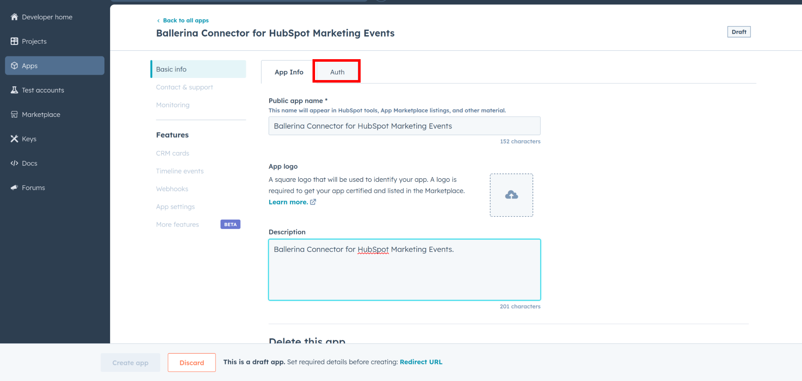
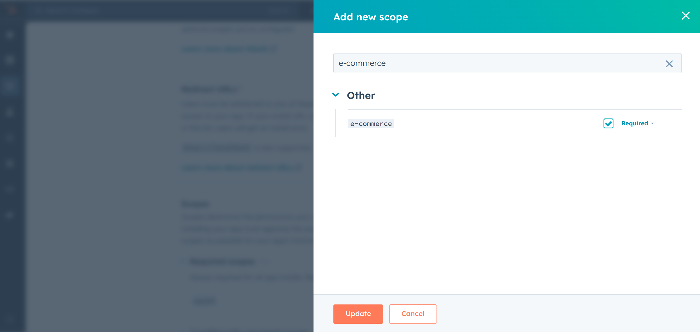

# Ballerina Ballerina HubSpot CRM Products Connector connector

[](https://github.com/ballerina-platform/module-ballerinax-hubspot.crm.object.products/actions/workflows/ci.yml)
[](https://github.com/ballerina-platform/module-ballerinax-hubspot.crm.object.products/actions/workflows/trivy-scan.yml)
[](https://github.com/ballerina-platform/module-ballerinax-hubspot.crm.object.products/actions/workflows/build-with-bal-test-graalvm.yml)
[](https://github.com/ballerina-platform/module-ballerinax-hubspot.crm.object.products/commits/master)
[](https://github.com/ballerina-platform/ballerina-library/labels/module%hubspot.crm.object.products)

## Overview

[HubSpot](https://www.hubspot.com/our-story) is an AI-powered customer relationship management (CRM) platform.

The `ballerinax/hubspot.crm.obj.products` package offers APIs to connect and interact with [HubSpot API for CRM Object Products](https://developers.hubspot.com/docs/reference/api/crm/objects/products) endpoints, specifically based on [HubSpot CRM Object Products API v3 OpenAPI spec](https://github.com/HubSpot/HubSpot-public-api-spec-collection/blob/main/PublicApiSpecs/CRM/Products/Rollouts/424/v3/products.json).

Use the products API to create and manage your product library, which is the collection of goods and services that your company offers. Products in your product library can be used as line items when creating deals, payment links, invoices, and quotes.

## Setup guide

To use the HubSpot CRM Object Products connector, you must have access to the HubSpot API through a HubSpot developer account and an associated HubSpot app. Therefore, if you don't have one already, you need to register for a developer account on HubSpot.

### Step 1: Create/Login to a HubSpot Developer Account

If you already have an account, go to the [HubSpot developer portal](https://app.hubspot.com/)

If you don't have a HubSpot Developer Account, you can sign up to a free account [here](https://developers.hubspot.com/get-started)

### Step 2 (Optional): Create a [Developer Test Account](https://developers.hubspot.com/beta-docs/getting-started/account-types#developer-test-accounts) under your account

Within app developer accounts, you can create developer test accounts to test apps and integrations without affecting any real HubSpot data.

**Note:** _These accounts are intended only for development and testing purposes and should not be used production environments._

1. Go to 'Test Account' section from the left sidebar.


2. Click 'Create developer test account'. In the dialog box, give a name to your test account and click 'Create'.


### Step 3: Create a HubSpot App under your account.

1. In your developer account, navigate to the 'Apps' section. Click on 'Create App'.


2. Provide the necessary details, including the app name and description.

### Step 4: Configure the Authentication Flow.

1. Move to the Auth Tab.



2. In the Scopes section, add the following scope for your app using the 'Add new scope' button.

   `e-commerce`



3. Add your Redirect URI in the relevant section. You can also use localhost addresses for local development purposes. Click 'Create App'.


### Step 5: Get your Client ID and Client Secret

- Navigate to the 'Auth' section of your app. Make sure to save the provided Client ID and Client Secret.


### Step 6: Setup Authentication Flow

Before proceeding with the Quickstart, ensure you have obtained the Access Token using the following steps:

1. Create an authorization URL using the following format:

   ```
   https://app.hubspot.com/oauth/authorize?client_id=<YOUR_CLIENT_ID>&scope=<YOUR_SCOPES>&redirect_uri=<YOUR_REDIRECT_URI>
   ```

   Replace the **YOUR_CLIENT_ID**, **YOUR_REDIRECT_URI** and **YOUR_SCOPES** with your specific value.

   **NOTE:** _If you are using a localhost redirect url, make sure to have a listener running at the relevant port before executing the next step._

2. Paste it in the browser and select your developer test account to install the app when prompted.


3. A code will be displayed in the browser. Copy the code.

4. Run the following curl command. Replace the **YOUR_CLIENT_ID**, **YOUR_REDIRECT_URI** and **YOUR_CLIENT_SECRET** with your specific value. Use the code you received in the above step 3 as the **CODE**.

   - Linux/macOS

     ```bash
     curl --request POST \
     --url https://api.hubapi.com/oauth/v1/token \
     --header 'content-type: application/x-www-form-urlencoded' \
     --data 'grant_type=authorization_code&code=<CODE>&redirect_uri=<YOUR_REDIRECT_URI>&client_id=<YOUR_CLIENT_ID>&client_secret=<YOUR_CLIENT_SECRET>'
     ```

   - Windows

     ```bash
     curl --request POST ^
     --url https://api.hubapi.com/oauth/v1/token ^
     --header 'content-type: application/x-www-form-urlencoded' ^
     --data 'grant_type=authorization_code&code=<CODE>&redirect_uri=<YOUR_REDIRECT_URI>&client_id=<YOUR_CLIENT_ID>&client_secret=<YOUR_CLIENT_SECRET>'
     ```

   This command will return the access token necessary for API calls.

   ```json
   {
     "token_type": "bearer",
     "refresh_token": "<Refresh Token>",
     "access_token": "<Access Token>",
     "expires_in": 1800
   }
   ```

5. Store the access token securely for use in your application.

## Quickstart

To use the **HubSpot CRM Object Products** connector in your Ballerina application, update the `.bal` file as follows:

### Step 1: Import the module

Import the `hubspot.crm.obj.products` module and `oauth2` module.

```ballerina
import ballerina/oauth2;
mport ballerinax/hubspot.crm.obj.products as products;
```

### Step 2: Instantiate a new connector

1. Create a `Config.toml` file and, configure the obtained credentials in the above steps as follows:

   ```toml
    clientId = <Client Id>
    clientSecret = <Client Secret>
    refreshToken = <Refresh Token>
   ```

2. Instantiate a `OAuth2RefreshTokenGrantConfig` with the obtained credentials and initialize the connector with it.

   ```ballerina
   configurable string clientId = ?;
   configurable string clientSecret = ?;
   configurable string refreshToken = ?;

   OAuth2RefreshTokenGrantConfig auth = {
       clientId,
       clientSecret,
       refreshToken,
       credentialBearer: oauth2:POST_BODY_BEARER
   };

   products:ConnectionConfig hubSpotConfig = {
      auth: testAuth
   };
   products:Client hubspotCrmObjectProducts = check new (hubSpotConfig);

   ```

### Step 3: Invoke the connector operation

Now, utilize the available connector operations. A sample usecase is shown below.

#### Create a product

```ballerina
public function main() returns error? {
  products: SimplePublicObjectInputForCreate payload = {
        "properties": {
            "name": "Coffee Grinder",
            "hs_sku": "CMK12346",
            "price": "540.00",
            "description": "A high-quality coffee grinder that powders excellent coffee."
        }
    };
    products: SimplePublicObject response = check hubspotCrmObjectProducts->/.post(payload);
}
```

## Examples

The `Ballerina HubSpot CRM Products Connector` connector provides practical examples illustrating usage in various scenarios. Explore these [examples](https://github.com/module-ballerinax-hubspot.crm.object.products/tree/main/examples/), covering the following use cases:

1. [Update Batch of Products](https://github.com/module-ballerinax-hubspot.crm.object.products/tree/main/examples/Update-products) - Integrate Ballerina Hubspot CRM Products Connector to update the properties of a batch of products.

2. [Filter and Archive Batch](https://github.com/module-ballerinax-hubspot.crm.object.products/tree/main/examples/search-and-archive) - Integrate Ballerina Hubspot CRM Products Connector to filter products based on the price and then archive the batch.

## Build from the source

### Setting up the prerequisites

1. Download and install Java SE Development Kit (JDK) version 21. You can download it from either of the following sources:

   - [Oracle JDK](https://www.oracle.com/java/technologies/downloads/)
   - [OpenJDK](https://adoptium.net/)

   > **Note:** After installation, remember to set the `JAVA_HOME` environment variable to the directory where JDK was installed.

2. Download and install [Ballerina Swan Lake](https://ballerina.io/).

3. Download and install [Docker](https://www.docker.com/get-started).

   > **Note**: Ensure that the Docker daemon is running before executing any tests.

4. Export Github Personal access token with read package permissions as follows,

   ```bash
   export packageUser=<Username>
   export packagePAT=<Personal access token>
   ```

### Build options

Execute the commands below to build from the source.

1. To build the package:

   ```bash
   ./gradlew clean build
   ```

2. To run the tests:

   ```bash
   ./gradlew clean test
   ```

3. To build the without the tests:

   ```bash
   ./gradlew clean build -x test
   ```

4. To run tests against different environments:

   ```bash
   ./gradlew clean test -Pgroups=<Comma separated groups/test cases>
   ```

5. To debug the package with a remote debugger:

   ```bash
   ./gradlew clean build -Pdebug=<port>
   ```

6. To debug with the Ballerina language:

   ```bash
   ./gradlew clean build -PbalJavaDebug=<port>
   ```

7. Publish the generated artifacts to the local Ballerina Central repository:

   ```bash
   ./gradlew clean build -PpublishToLocalCentral=true
   ```

8. Publish the generated artifacts to the Ballerina Central repository:

   ```bash
   ./gradlew clean build -PpublishToCentral=true
   ```

## Contribute to Ballerina

As an open-source project, Ballerina welcomes contributions from the community.

For more information, go to the [contribution guidelines](https://github.com/ballerina-platform/ballerina-lang/blob/master/CONTRIBUTING.md).

## Code of conduct

All the contributors are encouraged to read the [Ballerina Code of Conduct](https://ballerina.io/code-of-conduct).

## Useful links

- For more information go to the [`hubspot.crm.object.products` package](https://central.ballerina.io/ballerinax/hubspot.crm.object.products/latest).
- For example demonstrations of the usage, go to [Ballerina By Examples](https://ballerina.io/learn/by-example/).
- Chat live with us via our [Discord server](https://discord.gg/ballerinalang).
- Post all technical questions on Stack Overflow with the [#ballerina](https://stackoverflow.com/questions/tagged/ballerina) tag.
